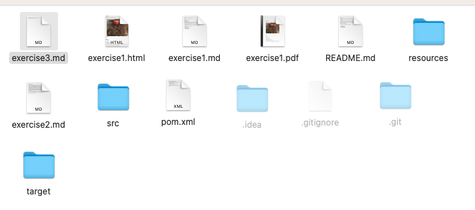
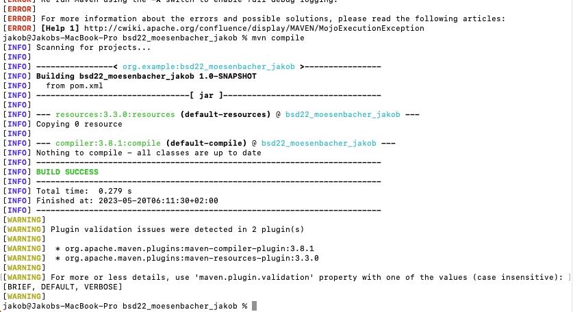

# Exercise 3
## Was ist nach dem ausführen des Programmes passiert?
Nach dem Ausführen des Programmes ist ein Ordner mit dem Namen Taget erstellt worden. In diesem befinden sich die ausführbaren .class files.

## mvn compile
